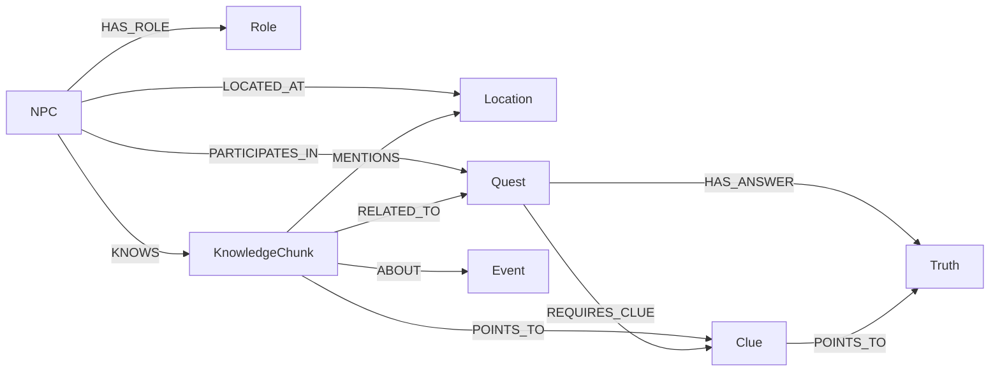
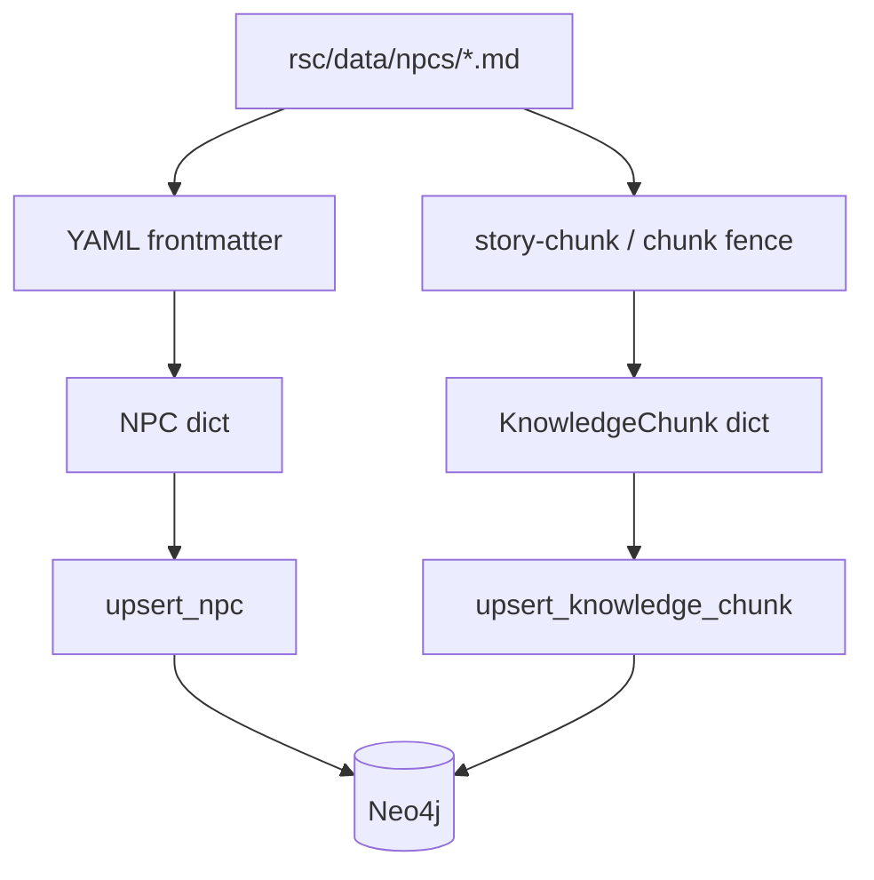
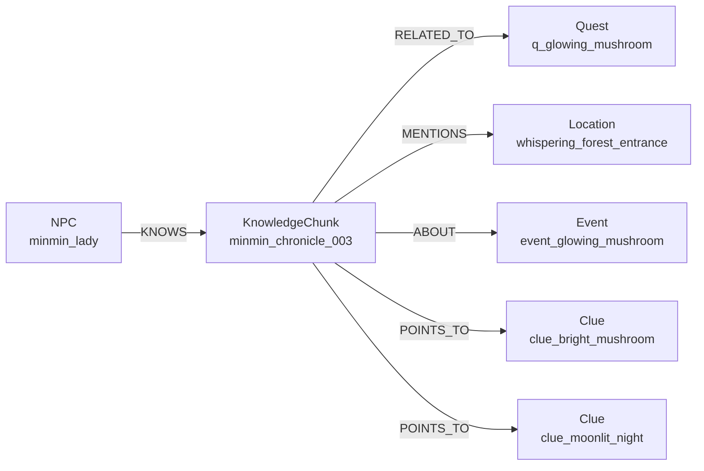
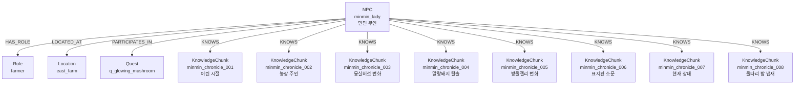
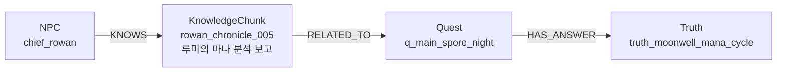
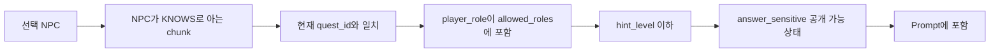

# Neo4j 데이터 구조 시각화 가이드

이 문서는 현재 프로젝트에서 Neo4j에 어떤 데이터가 어떤 구조로 적재되는지 따로 설명하는 전용 문서다. 발표자료나 전체 인수인계 보고서와 별개로, 그래프 DB 구조만 이해하고 싶을 때 이 문서를 보면 된다.

## 1. 전체 그래프 구조 한눈에 보기

Neo4j에는 NPC, Role, Location, Quest, Event, Clue, Truth, KnowledgeChunk가 들어간다. 그중 대화에 직접 쓰이는 핵심은 `NPC-[:KNOWS]->KnowledgeChunk` 관계다.



이 구조에서 `KnowledgeChunk`는 NPC가 말할 수 있는 근거 지식이다. Quest, Clue, Truth는 퀘스트 진행과 정답 공개 조건을 설명하고, Role과 Location은 NPC의 정체성과 위치를 설명한다.

## 2. 현재 적재되는 노드 종류

| Label | 고유 ID | 역할 |
|---|---|---|
| `NPC` | `npc_id` | 대화하는 인물. 성격, 말투, 제한 지식을 가진다. |
| `Role` | `role_id` | farmer, knight, mage, lord 같은 플레이어/NPC 역할 기준. |
| `Location` | `location_id` | NPC와 사건, chunk가 연결되는 장소. |
| `Quest` | `quest_id` | 플레이어가 진행하는 사건 단위. |
| `Event` | `event_id` | 세계에서 발생한 사건. |
| `Clue` | `clue_id` | 플레이어가 확인해야 하는 단서. |
| `Truth` | `truth_id` | 정답 또는 진실. 공개 조건이 중요하다. |
| `KnowledgeChunk` | `chunk_id` | NPC가 실제로 말할 수 있는 지식 조각. |

현재 MVP 기준 수량은 다음과 같다.

```text
NPC: 4
Quest: 5
Role: 4
Event: 5
Clue: 8
Truth: 3
KnowledgeChunk: 26
```

## 3. 핵심 관계 구조

관계는 단순 연결이 아니라 “누가 무엇을 말할 수 있는지”와 “그 지식이 어떤 퀘스트/단서와 관련되는지”를 표현한다.

| Relationship | 방향 | 의미 |
|---|---|---|
| `HAS_ROLE` | `NPC -> Role` | NPC의 역할을 연결한다. |
| `LOCATED_AT` | `NPC -> Location` | NPC가 위치한 장소를 연결한다. |
| `PARTICIPATES_IN` | `NPC -> Quest` | NPC가 관련된 주요 퀘스트를 연결한다. |
| `KNOWS` | `NPC -> KnowledgeChunk` | NPC가 말할 수 있는 지식 근거를 연결한다. |
| `RELATED_TO` | `KnowledgeChunk -> Quest` | 지식 chunk가 어떤 퀘스트와 관련되는지 연결한다. |
| `MENTIONS` | `KnowledgeChunk -> Location` | 지식 chunk가 언급하는 장소를 연결한다. |
| `ABOUT` | `KnowledgeChunk -> Event` | 지식 chunk가 다루는 사건을 연결한다. |
| `POINTS_TO` | `KnowledgeChunk -> Clue` | 지식 chunk가 어떤 단서를 제공하는지 연결한다. |
| `REQUIRES_CLUE` | `Quest -> Clue` | 퀘스트 해결에 필요한 단서를 연결한다. |
| `HAS_ANSWER` | `Quest -> Truth` | 퀘스트의 정답/진실을 연결한다. |
| `POINTS_TO` | `Clue -> Truth` | 단서가 어떤 진실을 가리키는지 연결한다. |

`POINTS_TO`는 두 곳에서 쓰인다. `KnowledgeChunk -> Clue`에서는 지식이 단서를 제공한다는 뜻이고, `Clue -> Truth`에서는 단서가 진실로 이어진다는 뜻이다. 시작 노드와 끝 노드의 label이 다르기 때문에 의미가 구분된다.

## 4. 원천 데이터가 그래프가 되는 흐름

Neo4j 구조는 직접 손으로 작성하는 것이 아니라 `rsc/data` 원천 파일에서 만들어진다.



NPC Markdown의 frontmatter는 `NPC` 노드 속성이 된다. 본문의 `story-chunk` 또는 `chunk` fence는 `KnowledgeChunk` 노드가 된다. 이때 chunk metadata 안의 `quest_id`, `location_ids`, `event_ids`, `clue_ids`가 각각 Neo4j 관계로 풀린다.

## 5. KnowledgeChunk 하나가 그래프에 들어가는 방식

예를 들어 chunk 하나가 다음 metadata를 가진다고 하자.

```yaml
chunk_id: minmin_chronicle_003
quest_id: q_glowing_mushroom
location_ids:
  - whispering_forest_entrance
event_ids:
  - event_glowing_mushroom
clue_ids:
  - clue_bright_mushroom
  - clue_moonlit_night
allowed_roles:
  - farmer
  - lord
answer_sensitive: false
hint_level: 1
```

이 chunk는 Neo4j에서 다음처럼 표현된다.



이때 `allowed_roles`, `answer_sensitive`, `hint_level`, `text`, `source_path`, `text_ref`는 `KnowledgeChunk` 노드의 속성으로 저장된다. 즉, 관계는 그래프 탐색에 쓰이고 속성은 런타임 필터와 prompt 생성에 쓰인다.

## 6. 민민 부인 기준 전체 그래프

민민 부인은 `minmin_lady`라는 NPC 노드로 적재된다. 주요 속성은 다음과 같다.

```yaml
npc_id: minmin_lady
name: 민민 부인
role: farmer
location_id: east_farm
main_quest: q_glowing_mushroom
```

민민 부인 기준의 그래프 구조는 다음과 같다.



민민 부인은 8개의 chunk를 가진다. 이 chunk들은 대부분 생활 관찰이며, 최종 진실이나 마법 원리를 직접 말하지 않는다. 새로 추가된 `minmin_chronicle_008`도 밤 냄새와 울타리 주변 반짝임이라는 직접 관찰만 다루므로, 민민 부인은 플레이어에게 농장과 마을에서 직접 본 변화만 말하는 NPC로 동작한다.

## 7. 민민 부인의 몽실버섯 chunk 상세 구조

`minmin_chronicle_003`은 민민 부인이 본 몽실버섯 변화에 대한 chunk다.


이 chunk의 공개 조건은 다음과 같다.

| 속성 | 값 | 의미 |
|---|---|---|
| `allowed_roles` | `farmer`, `lord` | 농부와 영주 역할에게 공개 가능 |
| `answer_sensitive` | `false` | 정답 민감 정보가 아니므로 초중반 힌트로 사용 가능 |
| `hint_level` | `1` | hint level 1 이상에서 조회 가능 |
| `quest_id` | `q_glowing_mushroom` | 빛나는 몽실버섯 퀘스트와 관련 |

이 구조 때문에 민민 부인은 몽실버섯의 원리를 말하지 않고, “밤에 빛난다”, “달이 밝으면 더 눈에 띈다”, “주변에 가루가 남는다” 같은 관찰만 말한다.

## 8. 로완의 기밀 chunk와 공개 차이

민민 부인과 다르게 로완은 정답에 가까운 기밀 정보를 가진다.



`rowan_chronicle_005`는 다음 공개 조건을 가진다.

```yaml
allowed_roles:
  - lord
answer_sensitive: true
hint_level: 3
```

이 차이 때문에 같은 질문이라도 민민 부인은 생활 관찰만 답하고, 로완은 조건이 맞을 때 더 깊은 종합 정보를 줄 수 있다. GraphRAG의 핵심은 바로 이 차이를 그래프 구조와 속성으로 표현하는 것이다.

## 9. 런타임에서 그래프가 조회되는 방식

Streamlit은 다음 Cypher 구조로 Neo4j를 조회한다.

```cypher
MATCH (:NPC {npc_id: $npc_id})-[:KNOWS]->(k:KnowledgeChunk)
WHERE
  ($quest_id IS NULL OR k.quest_id = $quest_id OR k.quest_id IS NULL)
  AND $player_role IN k.allowed_roles
  AND k.hint_level <= $allowed_hint_level
  AND (k.answer_sensitive = false OR $quest_state IN ["ready_to_answer", "solved"])
RETURN
  k.chunk_id AS chunk_id,
  k.title AS title,
  k.knowledge_type AS knowledge_type,
  k.quest_id AS quest_id,
  k.hint_level AS hint_level,
  k.answer_sensitive AS answer_sensitive,
  k.text AS text
ORDER BY
  CASE WHEN k.quest_id = $quest_id THEN 0 ELSE 1 END,
  k.hint_level DESC,
  k.chunk_id ASC
LIMIT $limit
```

앱 호출부의 기본 limit은 8이다. 이 쿼리는 먼저 지식을 걸러낸 뒤, 현재 퀘스트와 정확히 일치하는 chunk를 앞에 두고, 같은 우선순위 안에서는 높은 `hint_level`부터 `chunk_id` 오름차순으로 정렬한다.



따라서 Neo4j 그래프는 단순 저장소가 아니라, 어떤 지식이 현재 대화에 들어갈 수 있는지 결정하는 필터 구조다.

## 10. 확인용 Neo4j 쿼리

전체 노드 수 확인:

```cypher
MATCH (n)
RETURN labels(n) AS labels, count(*) AS count
ORDER BY count DESC;
```

NPC별 KnowledgeChunk 수 확인:

```cypher
MATCH (n:NPC)-[:KNOWS]->(k:KnowledgeChunk)
RETURN n.npc_id AS npc, count(k) AS chunks
ORDER BY npc;
```

민민 부인이 알고 있는 chunk 확인:

```cypher
MATCH (:NPC {npc_id: "minmin_lady"})-[:KNOWS]->(k:KnowledgeChunk)
RETURN k.chunk_id, k.title, k.quest_id, k.allowed_roles, k.answer_sensitive, k.hint_level
ORDER BY k.chunk_id;
```

민민 부인의 몽실버섯 chunk가 어떤 Quest/Clue와 연결되는지 확인:

```cypher
MATCH (k:KnowledgeChunk {chunk_id: "minmin_chronicle_003"})
OPTIONAL MATCH (k)-[:RELATED_TO]->(q:Quest)
OPTIONAL MATCH (k)-[:POINTS_TO]->(c:Clue)
RETURN k.chunk_id, q.quest_id, collect(c.clue_id) AS clues;
```

정답 민감 chunk 확인:

```cypher
MATCH (k:KnowledgeChunk)
WHERE k.answer_sensitive = true
RETURN k.npc_id, k.chunk_id, k.quest_id, k.hint_level, k.title
ORDER BY k.npc_id, k.chunk_id;
```

## 11. 이 구조를 이해할 때 기억할 점

Neo4j 구조를 볼 때 가장 중요한 질문은 세 가지다.

```text
1. 이 NPC가 이 chunk를 KNOWS로 알고 있는가?
2. 이 chunk가 어떤 Quest, Clue, Truth 흐름과 연결되는가?
3. 현재 role, hint_level, quest_state에서 이 chunk가 공개 가능한가?
```

이 세 질문에 답할 수 있으면 Neo4j 데이터 구조와 Streamlit 응답 구조를 함께 이해할 수 있다.

민민 부인 예시로 정리하면 다음과 같다.

```text
민민 부인
  -> farmer 역할, east_farm 위치
  -> 8개 KnowledgeChunk를 KNOWS로 가짐
  -> minmin_chronicle_003은 q_glowing_mushroom과 clue_bright_mushroom에 연결
  -> farmer/lord에게 hint 1부터 공개
  -> answer_sensitive가 false라 관찰 힌트로 사용 가능
  -> 최종 진실은 말하지 않음
```

이것이 현재 프로젝트의 Neo4j 데이터 구조 핵심이다.
