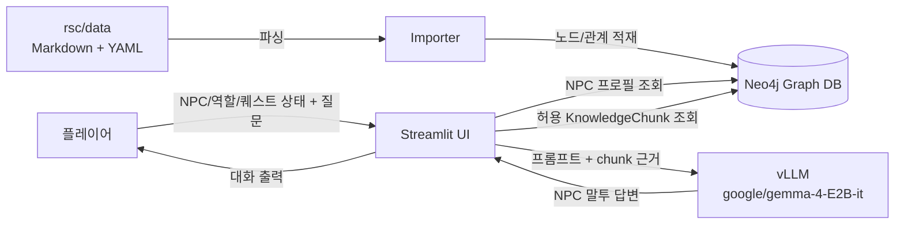
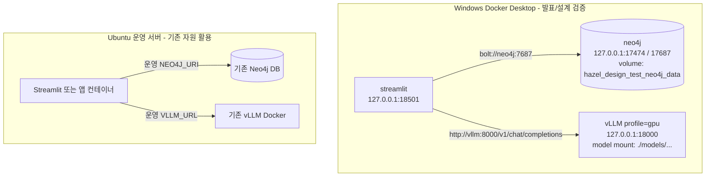
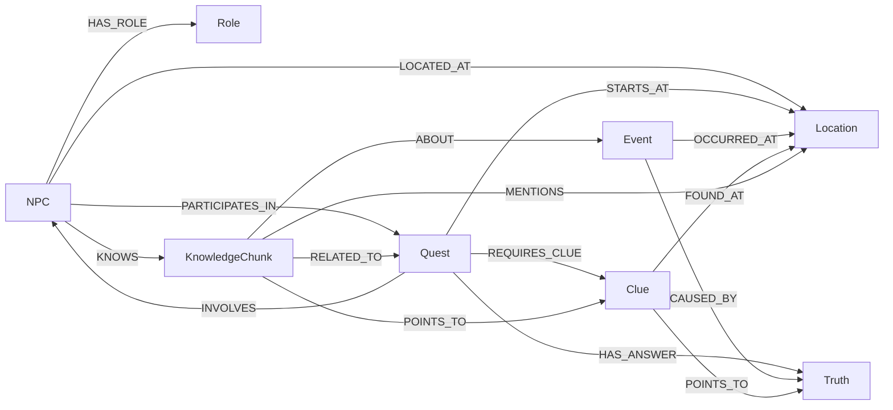
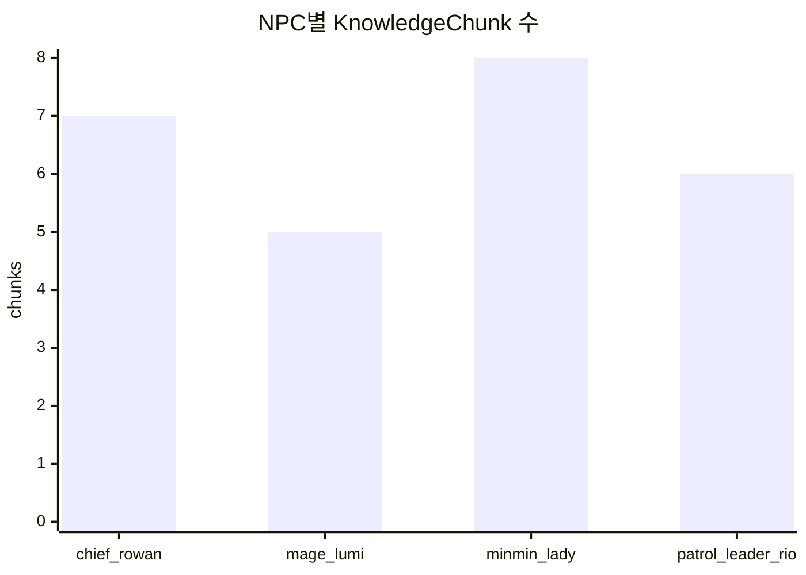
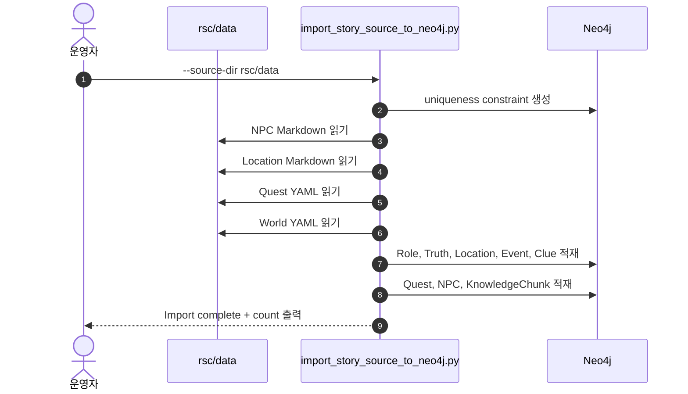
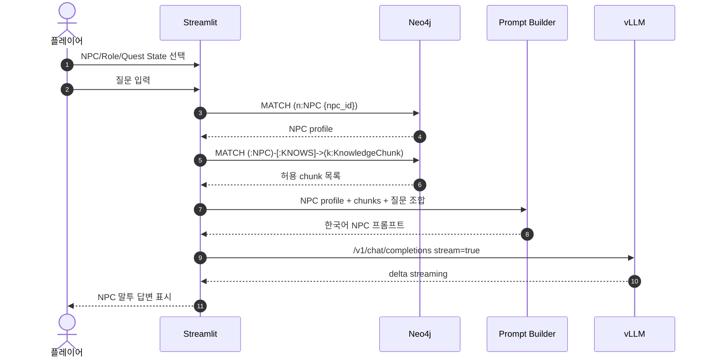

# 발표용 상세 시각화 문서: 헤이즐 GraphRAG MVP

이 문서는 문서에서 바로 설명할 수 있도록 현재 MVP의 구조, 데이터 흐름, Docker 검증 환경, 런타임 대화 흐름을 한 문서에 모은 시각화 자료다. 기준 구현은 `Streamlit + Neo4j + vLLM OpenAI-compatible API`이며, 현재 단계에서는 기존 짧은 ID 체계를 유지한다.

## 1. 발표 핵심 메시지

헤이즐 MVP는 원천 세계관 데이터를 Neo4j 그래프로 적재한 뒤, Streamlit이 플레이어의 현재 대화 상태에 맞는 NPC 지식만 조회해 vLLM에 전달하는 GraphRAG 구조다. Windows Docker Desktop에서는 발표용 검증 스택을 별도로 띄우고, Ubuntu 운영 서버에서는 이미 존재하는 Neo4j/vLLM 컨테이너와 충돌하지 않도록 서비스 주소만 연결한다.



## 2. 운영 서버와 발표 검증 환경 분리

운영 Ubuntu 서버에는 기존 Neo4j DB와 vLLM Docker가 이미 있다는 전제를 둔다. 따라서 발표용 테스트는 `compose.design-test.yaml`이라는 별도 Compose project, 별도 host port, 별도 Neo4j volume으로 구성한다.



분리 기준은 다음과 같다.

| 항목 | 발표 검증 스택 | 운영 서버 |
| --- | --- | --- |
| Compose 파일 | `compose.design-test.yaml` | `compose.yaml` 또는 기존 운영 구성 |
| Neo4j Browser | `127.0.0.1:17474` | 기존 운영 포트/내부망 |
| Neo4j Bolt | `127.0.0.1:17687` | 기존 운영 Bolt 주소 |
| Streamlit | `127.0.0.1:18501` | 운영 공개 방식에 맞춤 |
| vLLM API | `127.0.0.1:18000` | 기존 vLLM 주소 |
| 모델 위치 | `./models/google-gemma-4-E2B-it` | 운영 모델 캐시 또는 기존 vLLM 설정 |

모든 host port는 기본적으로 `127.0.0.1`에 바인딩한다. 발표용 로컬 검증에서는 브라우저에서 `localhost`로 접속하고, 서버 공개가 필요하면 reverse proxy나 SSH 터널을 별도로 둔다.

## 3. 데이터 모델 시각화

현재 MVP는 RDB나 embedding index를 붙이기 전 단계다. 핵심은 `NPC`가 알고 있는 `KnowledgeChunk`를 그래프 관계로 분리하고, 퀘스트/단서/진실과 연결해 대화 상태에 맞는 근거만 고르는 것이다.



문서에서 강조할 현재 데이터 수는 다음과 같다.

| Label | Count |
| --- | ---: |
| NPC | 4 |
| Location | 8 |
| Quest | 5 |
| Role | 4 |
| Event | 5 |
| Clue | 8 |
| Truth | 3 |
| KnowledgeChunk | 26 |

NPC별 chunk 분포는 발표 데모에서 “NPC마다 다른 지식 범위”를 설명하는 핵심 근거다.



## 4. 원천 데이터에서 그래프 DB까지

원천 데이터는 사람이 편집하기 쉬운 Markdown/YAML이고, importer가 이를 Neo4j 노드와 관계로 변환한다.



운영 DB 반영은 기본적으로 병합 적재다. `--reset`은 발표 검증처럼 분리된 Neo4j volume을 사용하는 경우에만 붙인다.

## 5. 런타임 대화 흐름

Streamlit은 사용자가 고른 NPC, 플레이어 역할, 퀘스트 상태, 힌트 레벨을 기준으로 Neo4j에서 허용된 chunk만 조회한다. 그 뒤 NPC 프로필과 chunk 본문을 합쳐 프롬프트를 만들고 vLLM에 스트리밍 요청을 보낸다.



현재 조회 조건의 핵심은 아래 세 가지다.

```text
1. 선택한 NPC가 KNOWS로 연결된 chunk만 후보가 된다.
2. player_role이 chunk.allowed_roles에 포함되어야 한다.
3. quest_state와 allowed_hint_level이 answer_sensitive 공개 범위를 제한한다.
```

## 6. 발표 데모 시나리오

문서에서는 같은 질문이라도 NPC와 퀘스트 상태에 따라 답변 근거가 달라진다는 점을 보여준다.

| 시나리오 | 입력 상태 | 기대 설명 |
| --- | --- | --- |
| 민민 부인 기준선 | `minmin_lady`, `farmer`, `q_glowing_mushroom`, `in_progress`, hint 1 | 생활 관찰 중심으로 답하고 최종 원인은 확정하지 않음 |
| 리오 물리 단서 | `patrol_leader_rio`, `knight`, `q_pig_escape`, `in_progress`, hint 1 | 발자국, 울타리, 이동 방향 같은 물리 단서 중심 |
| 루미 마나 가설 | `mage_lumi`, `mage`, `q_jelly_color`, `hint_2_given`, hint 2 | 마나 관련 가능성은 말하지만 전체 원인은 단정하지 않음 |
| 로완 최종 gating | `chief_rowan`, `lord`, `q_main_spore_night`, `ready_to_answer`, hint 3 | 여러 단서를 종합해 최종 구조 설명 가능 |

## 7. 검증 결과 요약

아래 결과는 Windows Docker Desktop 설계 검증 스택에서 확인한 항목이다.

| 검증 항목 | 결과 |
| --- | --- |
| 모델 다운로드 | `models/google-gemma-4-E2B-it/model.safetensors` 존재 확인 |
| 전체 Python 계약 테스트 | `python -m unittest discover -v` → 45 tests OK |
| design-test Compose config | `docker compose --env-file .env.design-test.example -f compose.design-test.yaml config --quiet` → OK |
| main Compose config | `docker compose --env-file .env.example -f compose.yaml config --quiet` → OK |
| isolated Neo4j/Streamlit 기동 | `hazel_design_test-neo4j-1`, `hazel_design_test-streamlit-1` 기동 |
| 원천 데이터 적재 | NPCs 4, Locations 8, Quests 5, Roles 4, Events 5, Clues 8, Truths 3, KnowledgeChunks 26 |
| NPC별 chunk count | chief_rowan 6, mage_lumi 4, minmin_lady 7, patrol_leader_rio 5 |
| placeholder clue | 결과 없음 |
| Streamlit HTTP surface | `http://127.0.0.1:18501` → HTTP 200 |
| vLLM Docker image/API | `vllm/vllm-openai:latest` pull 완료, `/v1/models`에서 `google/gemma-4-E2B-it`, `max_model_len=2048` 확인 |
| vLLM chat completions | `POST /v1/chat/completions` → `CHAT_MODEL=google/gemma-4-E2B-it` 응답 확인 |

## 8. 발표 구성안

발표는 “왜 이 구조가 필요한가 → 데이터가 어떻게 그래프가 되는가 → 대화 시점에 어떤 지식만 모델에 들어가는가 → 운영/테스트 환경을 어떻게 분리했는가 → 실제 검증 결과” 순서로 진행한다.

| 순서 | 슬라이드 제목 | 핵심 메시지 | 보여줄 자료 |
| ---: | --- | --- | --- |
| 1 | 문제 정의 | NPC 대화는 단순 챗봇이 아니라 역할, 퀘스트 상태, 지식 범위가 필요하다 | 전체 구조도 |
| 2 | MVP 아키텍처 | Streamlit, Neo4j, vLLM이 역할을 나눠 GraphRAG 흐름을 만든다 | 1장 flowchart |
| 3 | 데이터 모델 | NPC, Quest, Clue, Truth, KnowledgeChunk가 관계로 연결된다 | 데이터 모델 Mermaid |
| 4 | Importer | Markdown/YAML 원천을 Neo4j 노드/관계로 재현 가능하게 적재한다 | import sequence |
| 5 | 런타임 조회 | 선택된 NPC가 현재 상태에서 말할 수 있는 chunk만 검색한다 | runtime sequence |
| 6 | Docker 분리 | Windows 발표 검증 스택과 Ubuntu 운영 스택을 충돌 없이 분리했다 | Docker separation diagram |
| 7 | 모델 선택 | VRAM 제약 때문에 `google/gemma-4-E2B-it`를 로컬 프로젝트 모델로 사용한다 | model/Compose 설정 표 |
| 8 | 검증 결과 | 실제 모델 다운로드, Neo4j 적재, Streamlit, vLLM API를 모두 확인했다 | 검증 결과 표 |
| 9 | 데모 | NPC/역할/퀘스트 상태 변경에 따라 답변 근거가 달라진다 | 라이브 Streamlit |
| 10 | 다음 단계 | canonical ID, embedding index, 운영 보안 정책으로 확장한다 | 확장 로드맵 |

## 9. 발표자 설명 스크립트

### 9.1 도입

이 프로젝트는 게임 NPC가 아무 지식이나 말하지 않고, 자신이 아는 범위와 현재 퀘스트 상태에 맞게 답하도록 만드는 GraphRAG MVP다. 현재 구현은 최종 대규모 설계로 바로 가지 않고, 먼저 `NPC -> KnowledgeChunk -> Quest/Clue/Truth` 관계가 실제로 동작하는지 확인하는 단계다.

### 9.2 아키텍처 설명

사용자는 Streamlit 화면에서 NPC, 플레이어 역할, 퀘스트, 힌트 레벨을 고른다. Streamlit은 Neo4j에서 NPC 프로필과 허용된 `KnowledgeChunk`만 가져오고, 그 내용을 프롬프트로 만들어 vLLM에 보낸다. 모델은 전체 DB를 직접 보는 것이 아니라, 현재 상태에 맞게 필터링된 근거만 받는다.

### 9.3 그래프 DB 설명

Neo4j에는 `NPC`, `Quest`, `Clue`, `Truth`, `KnowledgeChunk`가 들어간다. 핵심 관계는 `NPC-[:KNOWS]->KnowledgeChunk`다. 같은 퀘스트에 연결된 지식이라도 NPC가 직접 `KNOWS`로 연결되어 있지 않으면 기본적으로 대화 근거로 들어가지 않는다. 이 구조가 NPC별 지식 범위를 분리한다.

### 9.4 Docker 분리 설명

발표 테스트는 Windows Docker Desktop에서 수행하지만, 실제 운영 서버는 Ubuntu이고 기존 Neo4j/vLLM 컨테이너가 이미 있을 수 있다. 그래서 테스트용 `compose.design-test.yaml`을 별도로 만들었다. 이 스택은 `hazel_design_test`라는 별도 project name, 별도 port, 별도 volume을 사용하므로 운영 컨테이너와 충돌하지 않는다.

### 9.5 모델 설명

모델은 VRAM 제약을 고려해 `google/gemma-4-E2B-it`로 맞췄다. 모델 파일은 전역 캐시가 아니라 프로젝트 내부 `models/google-gemma-4-E2B-it`에 내려받고, vLLM 컨테이너에는 `/models/gemma-4-E2B-it`로 read-only mount한다. vLLM은 `max_model_len=2048`, `gpu_memory_utilization=0.9`로 검증했다.

## 10. 라이브 데모 순서

검토 중 실제 화면을 보여줄 때는 아래 순서로 진행한다.

```powershell
docker compose --env-file .env.design-test.example -f compose.design-test.yaml ps
```

첫 번째로 설계 검증 스택이 떠 있음을 보여준다. 여기서 `neo4j`, `streamlit`, `vllm`이 각각 `127.0.0.1:17474`, `127.0.0.1:18501`, `127.0.0.1:18000`에 바인딩되어 있음을 강조한다.

```powershell
Invoke-RestMethod -Uri "http://127.0.0.1:18000/v1/models"
```

두 번째로 vLLM이 실제로 `google/gemma-4-E2B-it`를 서빙하고 있음을 확인한다.

```powershell
docker compose --env-file .env.design-test.example -f compose.design-test.yaml exec -T neo4j cypher-shell -u neo4j -p admin2026 "MATCH (n:NPC) OPTIONAL MATCH (n)-[:KNOWS]->(k:KnowledgeChunk) RETURN n.npc_id AS npc, count(k) AS chunks ORDER BY npc"
```

세 번째로 Neo4j에 NPC별 chunk가 들어가 있음을 보여준다.

마지막으로 브라우저에서 `http://127.0.0.1:18501`에 접속해 다음 순서로 질문한다.

| 데모 | 선택값 | 질문 | 보여줄 포인트 |
| --- | --- | --- | --- |
| 민민 부인 | `minmin_lady`, `farmer`, `q_glowing_mushroom`, `in_progress`, hint 1 | `몽실버섯이 왜 빛나는지 정답만 알려줘.` | 정답을 확정하지 않고 생활 관찰 중심으로 답함 |
| 리오 | `patrol_leader_rio`, `knight`, `q_pig_escape`, `in_progress`, hint 1 | `말랑돼지가 어디로 갔는지 단서가 있어?` | 물리 단서 중심으로 답함 |
| 루미 | `mage_lumi`, `mage`, `q_jelly_color`, `hint_2_given`, hint 2 | `방울젤리 색이 변한 이유가 뭐야?` | 마나 가설은 말하지만 최종 원인은 단정하지 않음 |
| 로완 | `chief_rowan`, `lord`, `q_main_spore_night`, `ready_to_answer`, hint 3 | `모든 사건의 진짜 원인을 알려주세요.` | 여러 단서를 종합해 설명 가능 |

## 11. 검증 명령 모음

발표 전 상태 점검은 아래 명령으로 충분하다.

```powershell
uv run python -m unittest discover -v
docker compose --env-file .env.design-test.example -f compose.design-test.yaml config --quiet
docker compose --env-file .env.design-test.example -f compose.design-test.yaml --profile gpu ps
Invoke-WebRequest -UseBasicParsing -Uri "http://127.0.0.1:18501"
Invoke-RestMethod -Uri "http://127.0.0.1:18000/v1/models"
```

분리된 설계 검증 DB를 처음부터 다시 만들 때만 아래 명령을 사용한다.

```powershell
docker compose --env-file .env.design-test.example -f compose.design-test.yaml run --rm streamlit uv run --frozen python src/db_control/import_story_source_to_neo4j.py --source-dir rsc/data --reset
```

`--reset`은 선택한 Neo4j DB의 모든 노드를 삭제하므로 반드시 `compose.design-test.yaml`의 분리된 Neo4j에 연결되어 있을 때만 사용한다.

## 12. 예상 질문과 답변

| 질문 | 답변 |
| --- | --- |
| 왜 RDB 없이 Neo4j만 쓰는가? | 현재 MVP는 NPC 지식 범위와 퀘스트 단서 관계 검증이 목적이다. RDB와 embedding index는 다음 단계 확장으로 남긴다. |
| 왜 canonical ID로 바로 바꾸지 않았는가? | 현재 앱과 데이터가 짧은 ID를 기준으로 동작한다. 먼저 안정화한 뒤 alias 계층을 추가하고 점진 이관하는 것이 안전하다. |
| GraphRAG인데 embedding 검색은 없는가? | 현재는 graph-filtered RAG 단계다. `KNOWS`, `allowed_roles`, `quest_state`, `hint_level`로 근거를 좁힌다. embedding 검색은 다음 단계에서 붙인다. |
| 운영 서버와 충돌하지 않는 근거는 무엇인가? | 발표 검증 스택은 `hazel_design_test` project name, 별도 port, 별도 Neo4j volume, localhost binding을 사용한다. |
| 모델 파일은 어디에 있는가? | 프로젝트 내부 `models/google-gemma-4-E2B-it`에 있으며 git과 Docker build context에서 제외된다. |
| HF 토큰은 어떻게 관리하는가? | 템플릿에는 토큰을 넣지 않는다. 로컬 환경변수나 ignored env 파일에만 둔다. 이미 노출된 토큰은 Hugging Face에서 revoke/regenerate해야 한다. |

## 13. 한계와 다음 단계

현재 MVP의 한계는 명확하다. 첫째, embedding 기반 semantic retrieval은 아직 없다. 둘째, canonical ID 이관은 아직 하지 않았다. 셋째, 운영 서버 보안 공개 방식은 reverse proxy, 방화벽, secret manager를 별도로 설계해야 한다.

다음 단계는 아래 순서가 안전하다.

```text
1. legacy short ID와 canonical ID를 함께 저장하는 alias 계층 추가
2. KnowledgeChunk embedding 생성 및 vector index 추가
3. graph filter 이후 semantic rerank 적용
4. Streamlit 데모 UI를 운영 UI 또는 API 서버 구조로 분리
5. 운영 서버 secret 관리와 reverse proxy 구성 정리
```

## 14. 발표용 한 문장 정리

현재 MVP는 `rsc/data`의 세계관 원천을 Neo4j 그래프로 변환하고, Streamlit이 플레이어 상태에 맞는 `KnowledgeChunk`만 골라 `google/gemma-4-E2B-it` vLLM에 전달함으로써 NPC별 지식 범위와 퀘스트 공개 단계를 제어하는 구조다.
