# 헤이즐 GraphRAG MVP 전체 구조 문서

이 문서는 현재 저장소에 구현된 MVP 구조를 기준으로, 데이터가 어디에서 시작해 어떤 함수와 서비스를 거쳐 사용자 응답으로 돌아오는지 시각적으로 설명한다. 범위는 현재 동작하는 `Streamlit + Neo4j + 외부 추론 서비스` 구조, importer, Neo4j 그래프 DB, Docker Compose 배포 구조다.

이 문서는 현재 MVP의 짧은 ID 체계를 기준으로 한다. `npc:*`, `quest:*`, `chunk:*` 같은 canonical ID 이관 설계는 이 문서의 대상이 아니다.

## 1. 한눈에 보는 전체 구조

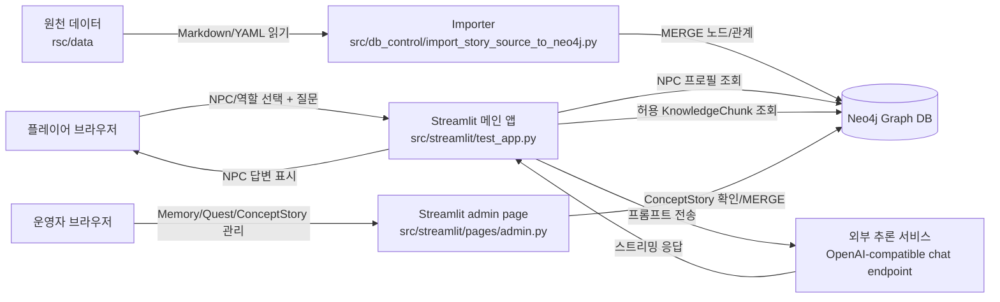

전체 시스템은 두 개의 큰 흐름으로 나뉜다.

1. 데이터 적재 흐름: `rsc/data`의 Markdown/YAML 원천 데이터를 importer가 읽고 Neo4j 그래프로 변환한다.
2. 런타임 대화 흐름: Streamlit 메인 앱이 사용자의 현재 NPC, 역할, 퀘스트 상태를 기준으로 Neo4j에서 NPC와 지식 chunk를 조회한 뒤, 외부 추론 서비스에 프롬프트를 보내 답변을 스트리밍한다. 별도 admin page는 세션 메모리 설정, Quest 상태, ConceptStory 노드 적재를 운영자 화면에서 다룬다.

## 2. 핵심 파일과 책임

| 파일 | 책임 | 런타임 여부 |
| --- | --- | --- |
| `rsc/data/npcs/*.md` | NPC frontmatter와 `KnowledgeChunk` 원문 정의 | importer 실행 시 사용 |
| `rsc/data/locations/*.md` | 장소 `Location` 정의 | importer 실행 시 사용 |
| `rsc/data/quests/*.yaml` | 퀘스트 `Quest`와 퀘스트-단서-정답 연결 정의 | importer 실행 시 사용 |
| `rsc/data/world/roles.yaml` | 플레이어/NPC 역할 `Role` 정의 | importer 실행 시 사용 |
| `rsc/data/world/events.yaml` | 사건 `Event` 정의 | importer 실행 시 사용 |
| `rsc/data/world/clues.yaml` | 단서 `Clue`와 단서-장소-진실 연결 정의 | importer 실행 시 사용 |
| `rsc/data/world/truths.yaml` | 정답/진실 `Truth`와 공개 조건 정의 | importer 실행 시 사용 |
| `src/db_control/import_story_source_to_neo4j.py` | 원천 데이터를 Neo4j 노드/관계로 적재 | 운영자가 명령으로 실행 |
| `src/streamlit/test_app.py` | 메인 채팅 UI, NPC/역할 선택, Neo4j 조회, per-NPC 메모리, 프롬프트 생성, 응답 스트리밍 | 사용자가 접속하는 앱 |
| `src/streamlit/pages/admin.py` | Streamlit admin page. Memory Admin, Quest Admin, Concept Story Admin 탭과 ConceptStory 확인/MERGE 처리 | 운영자가 접속하는 admin page |
| `compose.yaml` | Neo4j, Streamlit, 추론 서비스 컨테이너 정의 | 배포/실행 시 사용 |
| `docs/db_design.md` | 현재 MVP DB 설계 요약 | 참고 문서 |
| `docs/deployment.md` | Windows/Ubuntu 실행 및 배포 절차 | 참고 문서 |

## 3. 배포 토폴로지

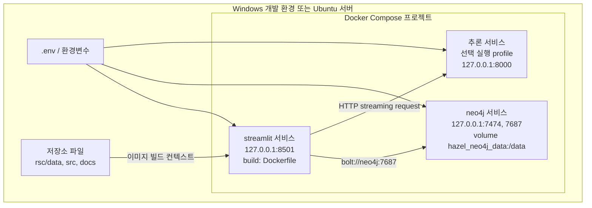

`compose.yaml`의 서비스 책임은 다음과 같다.

| 서비스 | 역할 | 주요 연결 |
| --- | --- | --- |
| `neo4j` | 그래프 DB. 모든 NPC, Quest, KnowledgeChunk, Clue, Truth 등의 최종 저장소 | Streamlit이 Bolt로 조회 |
| `streamlit` | 사용자 UI와 GraphRAG 런타임 로직 | Neo4j 조회, 외부 추론 서비스 호출 |
| `추론 서비스` | OpenAI-compatible HTTP 엔드포인트를 제공하는 응답 생성 서비스 | Streamlit이 HTTP로 호출 |

`streamlit`은 `depends_on.neo4j.condition: service_healthy`를 사용한다. 즉 Compose 기준으로는 Neo4j healthcheck가 통과한 뒤 Streamlit 컨테이너가 시작된다. 단, 데이터 적재는 자동으로 실행되지 않는다. 운영자는 별도 명령으로 importer를 실행해 Neo4j에 원천 데이터를 넣어야 한다.

## 4. 데이터 적재 흐름

### 4.1 전체 import sequence

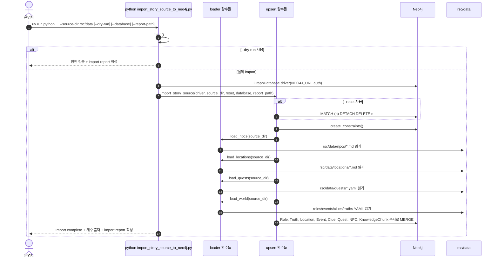

### 4.2 importer 함수 호출 구조

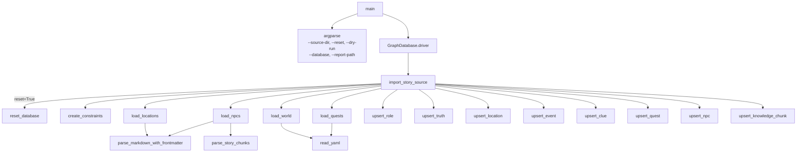

`main()`의 기본 `--source-dir` 값은 코드상 `rsc/data`다. 따라서 일반 문서와 검증 명령은 이 기본값에 맡기거나, 경로를 명시해야 할 때 `--source-dir rsc/data`를 붙이면 된다.

### 4.3 importer의 적재 순서가 중요한 이유

`import_story_source()`는 다음 순서로 노드와 관계를 만든다.

1. `Role`
2. `Truth`
3. `Location`
4. `Event`
5. `Clue`
6. `Quest`
7. `NPC`
8. `KnowledgeChunk`

이 순서는 관계 생성 시 placeholder 노드가 생기는 것을 줄이기 위한 구조다. 예를 들어 `KnowledgeChunk`는 `Quest`, `Location`, `Event`, `Clue`를 가리킨다. 이 대상 노드들이 먼저 만들어져 있으면 chunk 관계를 만들 때 속성이 빈 placeholder로 남을 가능성이 낮다.

다만 Cypher에서는 `MERGE`로 대상 노드를 만들기 때문에, 원천 데이터에 존재하지 않는 ID를 chunk가 참조하면 이름이나 요약 속성이 없는 노드가 생길 수 있다. 그래서 검증 쿼리에서 `Clue.name IS NULL`인 placeholder clue를 확인한다.

### 4.4 원천 데이터에서 Neo4j로 변환되는 방식

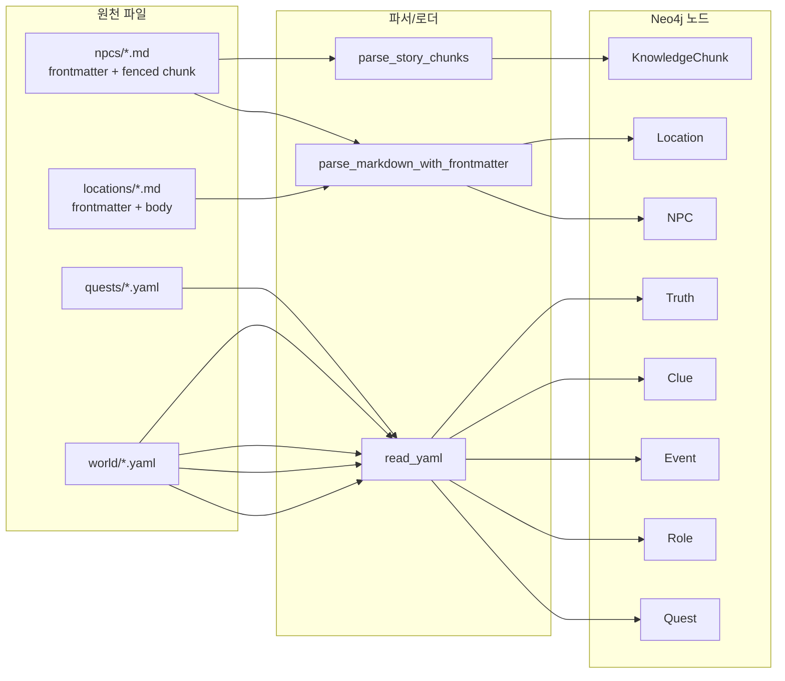

NPC Markdown은 두 종류의 데이터를 동시에 제공한다.

| Markdown 영역 | DB 결과 |
| --- | --- |
| YAML frontmatter | `NPC` 노드 속성 |
| `story-chunk` 또는 `chunk` fenced block metadata | `KnowledgeChunk` 속성과 관계 ID 목록 |
| fenced block 뒤의 본문 | `KnowledgeChunk.text` |

`parse_story_chunks()`는 chunk metadata에 다음 필드가 없으면 예외를 발생시킨다.

```text
chunk_id, phase, title, knowledge_type, quest_id,
location_ids, event_ids, clue_ids, allowed_roles,
answer_sensitive, hint_level, tags
```

이 검증은 import 전에 원천 문서의 최소 구조를 강제하는 역할을 한다.

## 5. Neo4j DB 상세 구조

### 5.1 현재 MVP 목표 개수

| Label | Count |
| --- | ---: |
| `NPC` | 4 |
| `Location` | 8 |
| `Quest` | 5 |
| `Role` | 4 |
| `Event` | 5 |
| `Clue` | 8 |
| `Truth` | 3 |
| `KnowledgeChunk` | 26 |

### 5.2 노드 라벨과 고유 키

```mermaid
erDiagram
    NPC {
        string npc_id PK
        string name
        string role
        string location_id
        string main_quest
        list personality
        list speech_style
        list knowledge_scope
        list restricted_knowledge
        list dialogue_must
        list dialogue_must_not
        string source_path
    }

    ROLE {
        string role_id PK
        string name
        string description
    }

    LOCATION {
        string location_id PK
        string name
        string mood
        string summary
        string function
        list tags
        string source_path
    }

    QUEST {
        string quest_id PK
        string title
        string quest_type
        string summary
        string main_location_id
        list states
        list tags
    }

    EVENT {
        string event_id PK
        string name
        string summary
        boolean visible
        list tags
    }

    CLUE {
        string clue_id PK
        string name
        string summary
        int hint_level
        boolean answer_sensitive
        list tags
    }

    TRUTH {
        string truth_id PK
        string name
        string summary
        boolean answer_sensitive
        list reveal_quest_states
        list required_clue_ids
        list tags
    }

    KNOWLEDGE_CHUNK {
        string chunk_id PK
        string npc_id
        string phase
        string title
        string knowledge_type
        string quest_id
        list allowed_roles
        boolean answer_sensitive
        int hint_level
        list tags
        string text
        string text_ref
        string source_path
    }

    CONCEPT_STORY {
        string concept_id PK
        string category
        string title
        string text
        string quest_id
        string npc_id
        int updated_at_ms
    }
```

`create_constraints()`는 다음 unique constraint를 생성한다.

| Constraint 대상 | 고유 키 |
| --- | --- |
| `NPC` | `npc_id` |
| `Role` | `role_id` |
| `Location` | `location_id` |
| `Quest` | `quest_id` |
| `Event` | `event_id` |
| `Clue` | `clue_id` |
| `Truth` | `truth_id` |
| `KnowledgeChunk` | `chunk_id` |

이 제약은 importer가 같은 원천 데이터를 여러 번 병합해도 동일 ID의 노드가 중복 생성되지 않게 한다.

`ConceptStory`는 importer가 만드는 원천 그래프가 아니라 `src/streamlit/pages/admin.py`의 Concept Story Admin 탭이 `concept_id`로 확인하고 `MERGE`하는 standalone 노드다. 현재 importer의 constraint 생성 대상에는 포함되지 않으며, 기존 `KnowledgeChunk` 관계나 조회 조건에도 연결되지 않는다.

### 5.3 관계 전체 지도

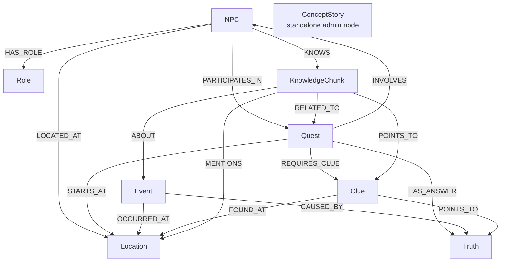

### 5.4 관계별 생성 위치와 의미

| 관계 | 생성 함수 | From -> To | 의미 |
| --- | --- | --- | --- |
| `HAS_ROLE` | `upsert_npc()` | `NPC` -> `Role` | NPC의 역할/직업 |
| `LOCATED_AT` | `upsert_npc()` | `NPC` -> `Location` | NPC 기본 위치 |
| `PARTICIPATES_IN` | `upsert_npc()` | `NPC` -> `Quest` | NPC의 대표 퀘스트 |
| `STARTS_AT` | `upsert_quest()` | `Quest` -> `Location` | 퀘스트 주요 시작 위치 |
| `INVOLVES` | `upsert_quest()` | `Quest` -> `NPC` | 퀘스트 관련 NPC |
| `REQUIRES_CLUE` | `upsert_quest()` | `Quest` -> `Clue` | 퀘스트 풀이에 필요한 단서 |
| `HAS_ANSWER` | `upsert_quest()` | `Quest` -> `Truth` | 퀘스트 정답으로 이어지는 진실 |
| `OCCURRED_AT` | `upsert_event()` | `Event` -> `Location` | 사건 발생 위치 |
| `CAUSED_BY` | `upsert_event()` | `Event` -> `Truth` | 사건의 원인 |
| `FOUND_AT` | `upsert_clue()` | `Clue` -> `Location` | 단서가 발견되는 위치 |
| `POINTS_TO` | `upsert_clue()` | `Clue` -> `Truth` | 단서가 가리키는 진실 |
| `KNOWS` | `upsert_knowledge_chunk()` | `NPC` -> `KnowledgeChunk` | NPC가 말할 수 있는 지식 단위 |
| `RELATED_TO` | `upsert_knowledge_chunk()` | `KnowledgeChunk` -> `Quest` | chunk가 속한 퀘스트 |
| `MENTIONS` | `upsert_knowledge_chunk()` | `KnowledgeChunk` -> `Location` | chunk가 언급하는 장소 |
| `ABOUT` | `upsert_knowledge_chunk()` | `KnowledgeChunk` -> `Event` | chunk가 다루는 사건 |
| `POINTS_TO` | `upsert_knowledge_chunk()` | `KnowledgeChunk` -> `Clue` | chunk가 제공하는 단서 |

`POINTS_TO`는 두 곳에서 쓰인다. `Clue -> Truth`에서는 단서가 어떤 진실을 가리키는지 뜻하고, `KnowledgeChunk -> Clue`에서는 NPC 지식이 어떤 단서를 제공하는지 뜻한다. 같은 관계명이지만 시작/도착 라벨 조합이 다르므로 의미가 구분된다.

### 5.5 NPC별 KnowledgeChunk 분포

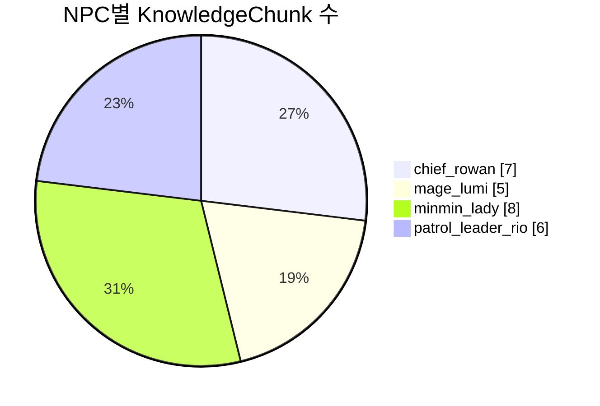

이 분포는 런타임에서 특정 NPC를 선택했을 때 조회 가능한 후보 지식의 상한을 결정한다. Streamlit 앱은 매 질문마다 해당 NPC에서 시작하는 `KNOWS` 관계만 따라간다. 다른 NPC의 chunk는 같은 퀘스트에 연결되어 있더라도 조회 시작점이 다르기 때문에 기본적으로 섞이지 않는다.

## 6. Streamlit 런타임 흐름

### 6.1 사용자 요청부터 답변까지

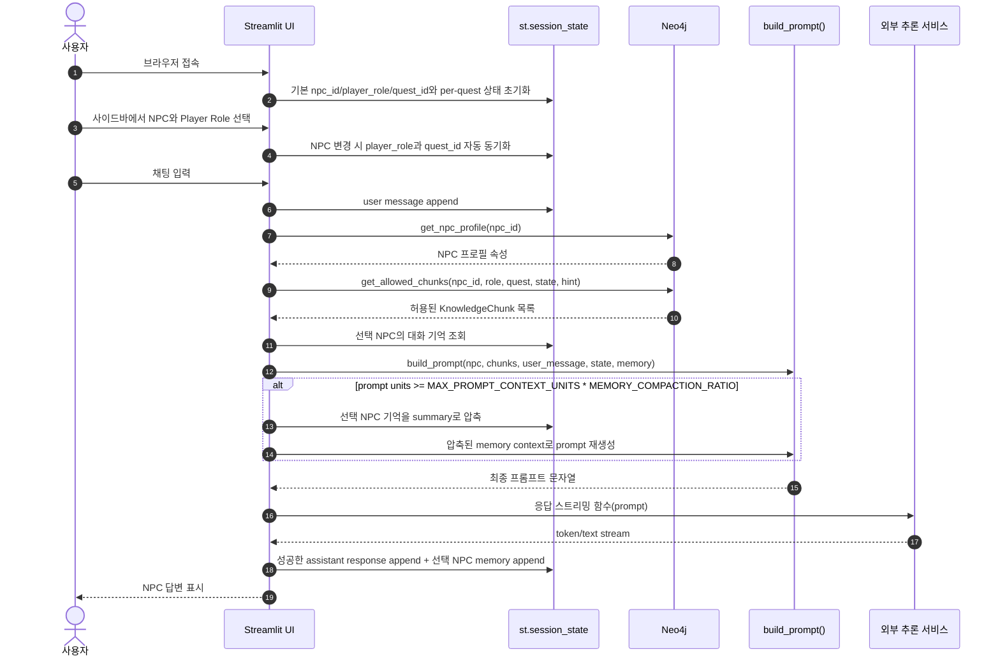

### 6.2 Streamlit 파일 내부 실행 순서

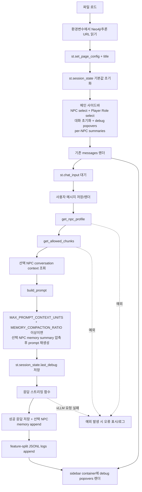

Streamlit은 스크립트 재실행 방식으로 동작한다. 사용자가 NPC 또는 Player Role을 바꾸거나 채팅을 입력하면 파일이 다시 실행되고, `st.session_state`에 저장된 값으로 이전 대화와 현재 선택 상태를 복원한다. 메인 사이드바에는 Quest 상태나 hint level을 직접 조작하는 UI가 없다. Quest 상태와 그에 연결된 hint level은 admin page의 Quest Admin 탭에서 저장하거나, 현재 `quest_id`에 저장된 세션 상태에서 복원된다.

### 6.3 세션 상태 구조

| `st.session_state` 키 | 기본값 | 의미 |
| --- | --- | --- |
| `messages` | `[]` | 화면에 렌더링할 대화 기록 |
| `npc_id` | `minmin_lady` | 현재 대화할 NPC ID |
| `previous_npc_id` | 현재 `npc_id` | NPC 변경 로그와 자동 동기화 기준 |
| `player_role` | `farmer` | 플레이어 역할 |
| `quest_id` | `q_glowing_mushroom` | 현재 퀘스트 |
| `quest_state` | `in_progress` | 현재 퀘스트 진행 상태 |
| `allowed_hint_level` | `hint_level_for_quest_state(quest_state)` | 현재 퀘스트 상태에서 계산된 조회 허용 힌트 레벨 |
| `quest_state_by_quest` | 모든 quest ID에 `in_progress` | 퀘스트별 진행 상태. Quest Admin과 메인 앱이 같은 session state를 읽고 쓴다 |
| `allowed_hint_level_by_quest` | 퀘스트별 상태에서 계산 | 퀘스트별 hint level 캐시. 값은 quest state에 연결되어 계산된다 |
| `memory_by_npc` | NPC별 빈 list | 세션 안에서만 유지되는 per-NPC 최근 대화 turn |
| `memory_summary_by_npc` | NPC별 빈 문자열 | 세션 안에서만 유지되는 per-NPC 압축 요약 |
| `max_memory_count_by_npc` | NPC별 `40` | turn 개수 기반 압축 기준. Memory Admin에서 조정한다 |
| `last_debug` | `{"retrieved_chunks": [], "prompt": ""}` | 마지막 조회 chunk와 최종 프롬프트. sidebar debug popovers가 나누어 보여준다 |
| `concept_story_existing_text` | `""` | Concept Story Admin에서 조회한 기존 DB text 표시용 |
| `concept_story_new_text` | `""` | Concept Story Admin에서 방금 입력한 text 표시용 |

NPC를 바꾸면 `NPC_METADATA`에 따라 `player_role`과 `quest_id`가 자동 동기화되고, 해당 `quest_id`의 `quest_state`와 `allowed_hint_level`이 복원된다. Player Role은 메인 사이드바에서 수동 변경할 수 있다. Quest Admin은 `quest_state_by_quest`를 저장하고, `allowed_hint_level_by_quest`는 `not_started=0`, `in_progress=1`, `hint_1_given=1`, `hint_2_given=2`, `ready_to_answer=3`, `solved=3` 규칙으로 함께 갱신한다.

상태 선택값은 `get_allowed_chunks()`의 파라미터로 들어가고, 최종 프롬프트의 `[현재 대화 조건]`에도 포함된다. `last_debug`는 채팅 제출 처리 안에서 갱신되며, 메인 사이드바의 `Debug: Retrieved Chunks`, `Debug: Prompt`, `Debug: Runtime` popover가 이를 나누어 보여준다. 같은 사이드바 아래의 per-NPC 요약 expander는 `memory_by_npc`와 `memory_summary_by_npc` 상태를 읽는다.

## 7. Streamlit에서 Neo4j를 조회하는 방식

### 7.1 Driver 생성

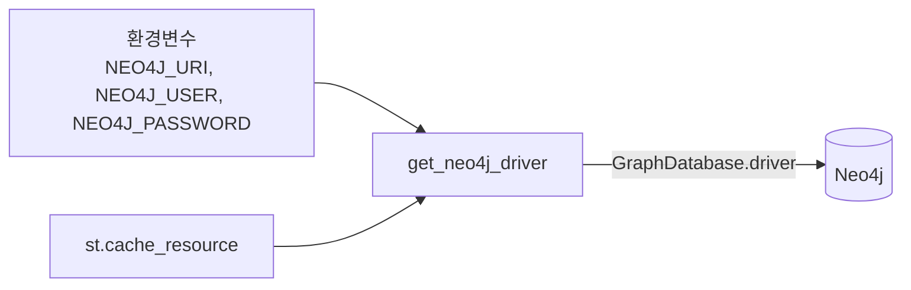

`get_neo4j_driver()`는 `@st.cache_resource`가 붙어 있다. Streamlit이 스크립트를 재실행해도 같은 설정의 Neo4j driver를 재사용하기 위한 구조다.

### 7.2 NPC 프로필 조회

`get_npc_profile(npc_id)`는 다음 순서로 동작한다.

1. `MATCH (n:NPC {npc_id: $npc_id})`로 NPC를 찾는다.
2. 말투/성격/지식 범위/금지 지식/대화 규칙에 필요한 속성만 반환한다.
3. 결과가 없으면 `ValueError("NPC not found: ...")`를 발생시킨다.
4. 호출부의 `try/except`가 이 예외를 잡아 Streamlit 채팅에 오류 메시지를 표시한다.

조회되는 속성은 다음과 같다.

```text
npc_id, name, role,
personality, speech_style,
knowledge_scope, restricted_knowledge,
dialogue_must, dialogue_must_not
```

### 7.3 KnowledgeChunk 조회

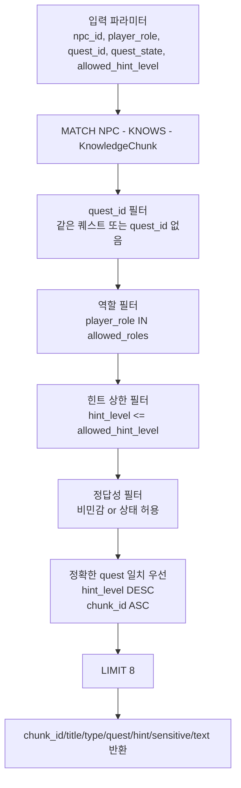

현재 Cypher 조건은 다음 개념을 구현한다.

| 조건 | 의미 |
| --- | --- |
| `(:NPC {npc_id})-[:KNOWS]->(k)` | 선택한 NPC가 알고 있는 chunk만 후보가 된다 |
| `quest_id` 일치 또는 `k.quest_id IS NULL` | 현재 퀘스트와 관련 있거나 범용 지식인 chunk만 허용한다 |
| `player_role IN k.allowed_roles` | 현재 플레이어 역할에게 말할 수 있는 chunk만 허용한다 |
| `k.hint_level <= allowed_hint_level` | 허용 힌트 레벨 이하의 지식만 통과한다 |
| `k.answer_sensitive = false` | 민감하지 않은 지식은 기본 허용한다 |
| `quest_state IN [ready_to_answer, solved]` | 정답 공개 가능한 상태면 민감 지식도 허용한다 |
| `ORDER BY CASE WHEN k.quest_id = $quest_id THEN 0 ELSE 1 END, k.hint_level DESC, k.chunk_id ASC LIMIT 8` | 정확한 퀘스트 일치 chunk를 먼저 두고, 허용 범위 안에서는 높은 힌트부터 최대 8개를 전달한다 |

이 조회는 MVP의 핵심 GraphRAG 단계다. embedding 검색은 없지만, 그래프 관계와 속성 조건으로 “현재 NPC가 현재 상황에서 말할 수 있는 지식”만 좁힌다.

## 8. 프롬프트 생성과 응답 처리

### 8.1 프롬프트 조립 구조

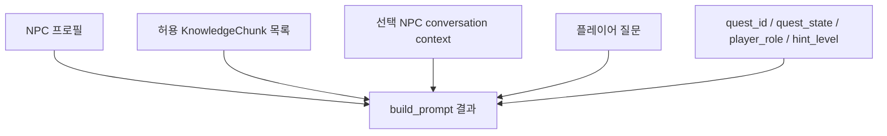

`build_prompt()`는 다음 블록을 하나의 문자열로 합친다.

| 프롬프트 블록 | 입력 데이터 | 목적 |
| --- | --- | --- |
| NPC 기본 정보 | `npc_id`, `name`, `role` | 응답 화자 고정 |
| 성격 | `personality` | 캐릭터 성격 반영 |
| 말투 | `speech_style` | 캐릭터 말투 반영 |
| 반드시 지킬 규칙 | `dialogue_must` | 대화 정책 적용 |
| 절대 하지 말아야 할 것 | `dialogue_must_not` | 금지 행동 적용 |
| 현재 대화 상태 | session state 값 | 퀘스트 진행 상태 반영 |
| 이전 대화 기억 | 선택 NPC의 memory summary와 최근 turn | NPC별 세션 대화 맥락 반영 |
| 사용 가능한 지식 | 조회된 chunk title과 text | 답변 근거 제공 |
| 응답 정책 | 고정 규칙 | 환각/메타 발화/정답 누설 제한 |
| 플레이어 질문 | 사용자가 입력한 문장 | 실제 응답 대상 |

`string_list()`는 Neo4j에서 돌아온 속성이 list가 아닐 때 빈 list로 바꾼다. `bullet_list()`는 빈 list를 `- 없음`으로 표현한다. 이 두 함수는 프롬프트의 리스트 블록이 깨지지 않게 만드는 보조 함수다.

NPC-facing context에는 chunk의 `title`과 `text`, NPC의 기본 이름과 역할, 성격, 말투, 대화 규칙, 현재 대화 조건, 선택 NPC의 세션 대화 기억만 들어간다. `chunk_id`, `knowledge_type`, `hint_level`, `answer_sensitive` 같은 내부 chunk metadata는 모델에게 직접 보이지 않는다. NPC frontmatter의 `knowledge_scope`와 `restricted_knowledge`도 raw 값 그대로 넣지 않고, 실제 대사 제어는 `dialogue_must`, `dialogue_must_not`, 조회된 chunk 본문, 응답 정책으로 수행한다.

프롬프트 길이 관리는 세션 메모리에서 처리한다. 앱은 먼저 현재 `memory_summary_by_npc[npc_id]`와 `memory_by_npc[npc_id]`로 conversation context를 만든 뒤 prompt를 조립한다. 전체 컨텍스트에서 응답 예산 `VLLM_MAX_RESPONSE_TOKENS = 512`를 먼저 뺀 `MAX_PROMPT_CONTEXT_UNITS = MAX_CONTEXT_TOKENS - VLLM_MAX_RESPONSE_TOKENS`를 prompt context 예산으로 잡고, `estimate_prompt_units(prompt)`가 `int(MAX_PROMPT_CONTEXT_UNITS * MEMORY_COMPACTION_RATIO)` 이상이면 해당 NPC의 최근 turn 전체를 summary에 병합하고 `memory_by_npc[npc_id]`를 비운 다음, 같은 NPC, chunk, 사용자 질문으로 prompt를 다시 만든다. 현재 `MEMORY_COMPACTION_RATIO`는 `0.9`다. 이 압축은 세션 상태에만 영향을 주며 Neo4j `KnowledgeChunk` 조회 결과를 바꾸지 않는다.

### 8.2 응답 스트리밍 처리

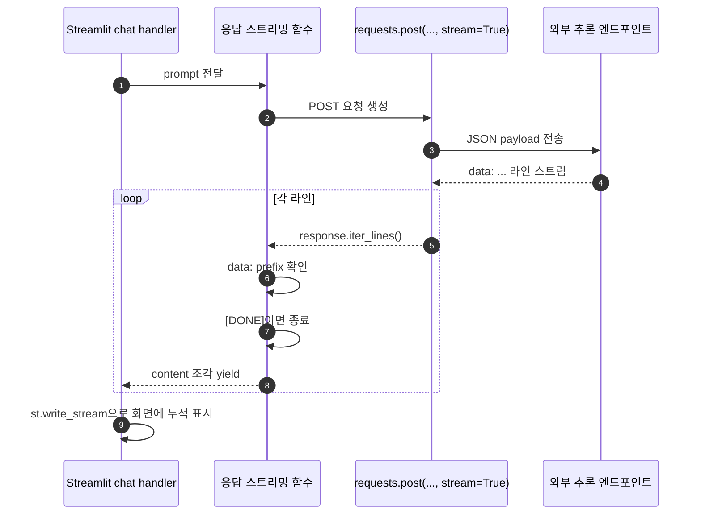

응답 처리의 핵심은 `stream=True`다. 전체 응답이 끝날 때까지 기다린 뒤 한 번에 보여주는 방식이 아니라, 성공 응답에서는 들어오는 조각을 `yield`하고 `st.write_stream()`이 이를 화면에 누적한다.

vLLM 요청 실패는 `VllmRequestError`로 올라오고, chat handler가 `st.error(e.display_message)`로 화면에 표시한 뒤 오류 context를 별도 로그로 남긴다. 이 실패는 assistant chat, 선택 NPC memory, 정상 대화 로그로 저장하지 않는다. Neo4j 조회나 prompt 생성 단계에서 발생한 예외도 chat handler의 `try/except`가 잡아서 화면에 표시한다.

## 9. 런타임 데이터 이동 상세

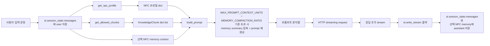

데이터 타입 관점에서 보면 다음과 같다.

| 단계 | 입력 | 출력 |
| --- | --- | --- |
| 채팅 입력 | 문자열 | `{"role": "user", "content": ...}` |
| NPC 조회 | `npc_id: str` | `dict[str, object]` |
| chunk 조회 | `npc_id`, `role`, `quest`, `state`, `hint` | `list[dict[str, object]]` |
| memory context | 선택 NPC의 summary와 최근 turn | 프롬프트용 이전 대화 기억 문자열 |
| 프롬프트 생성 | NPC dict, chunk list, 사용자 질문, 상태값, memory context | `str` |
| prompt compaction | prompt units가 `int(MAX_PROMPT_CONTEXT_UNITS * MEMORY_COMPACTION_RATIO)` 이상인 경우 | 선택 NPC memory summary 갱신 후 재생성한 prompt |
| 추론 요청 | prompt 문자열 | 스트리밍 text 조각 |
| 화면 출력 | text 조각 | 누적된 assistant response |
| 히스토리 저장 | user와 assistant response | `messages`와 선택 NPC memory에 append |

### 9.1 Feature-split JSONL 로그

메인 앱과 admin page는 기능별 JSONL 파일을 나누어 쓴다. 모든 레코드는 저장 직전에 `timestamp_ms`를 붙인다.

| Category | 기본 경로 | 주요 이벤트 |
| --- | --- | --- |
| `chat` | `output/reports/streamlit_llm_interactions.jsonl` | 입력, 출력, 선택 상태, debug payload |
| `retrieval` | `output/reports/streamlit_retrieval_events.jsonl` | chunk 조회 개수와 NPC/quest |
| `prompt` | `output/reports/streamlit_prompt_events.jsonl` | prompt 생성과 prompt units |
| `memory` | `output/reports/streamlit_memory_events.jsonl` | memory turn 추가, turn count 압축, context 압축, reset, admin memory 설정 |
| `admin` | `output/reports/streamlit_admin_events.jsonl` | NPC 자동 동기화, role 변경, Quest Admin 저장, ConceptStory 확인/검증/적재 |
| `neo4j_import` | `output/reports/streamlit_neo4j_import_events.jsonl` | admin page의 ConceptStory upsert 기록 |

## 10. Importer와 Streamlit의 DB 사용 차이

| 구분 | Importer | Streamlit 메인 앱 | Streamlit admin page |
| --- | --- | --- | --- |
| 목적 | 원천 데이터를 그래프 DB로 변환 | 그래프 DB에서 현재 대화에 필요한 데이터 조회 | 세션 memory, per-quest 상태, standalone ConceptStory 운영 |
| 실행 주체 | 운영자/배포 스크립트 | 사용자 브라우저 요청에 따른 앱 실행 | 운영자 브라우저 요청에 따른 admin page 실행 |
| DB 작업 | `MERGE`, `SET`, 관계 생성, constraint 생성 | `MATCH`, `RETURN` 조회 | `ConceptStory` `MATCH`, `MERGE`, `SET` |
| 주요 함수 | `import_story_source()`, `upsert_*()` | `get_npc_profile()`, `get_allowed_chunks()` | `fetch_concept_story()`, `upsert_concept_story()` |
| 실패 방식 | 예외 발생 시 import 중단 | 화면에 오류 메시지 표시, vLLM 요청 실패는 오류 로그만 남기고 assistant chat/memory에는 저장하지 않음 | admin 화면에 validation/error/success 표시 |
| 데이터 방향 | 파일 -> Neo4j | Neo4j -> 프롬프트 -> 사용자 화면 | admin 입력 -> session state 또는 ConceptStory node |

## 11. 운영 시나리오별 흐름

### 11.1 최초 데이터 구축

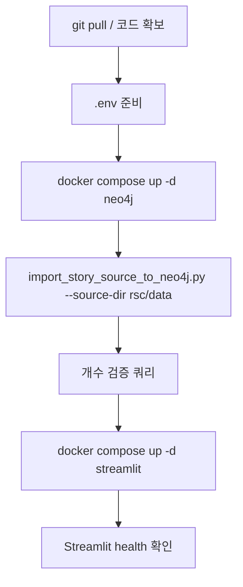

운영 DB는 기본적으로 `--reset` 없이 병합 적재한다. `--reset`은 모든 노드를 삭제하므로 분리된 개발 DB나 검증용 DB 재생성에만 사용한다.

### 11.2 일반 사용자 대화

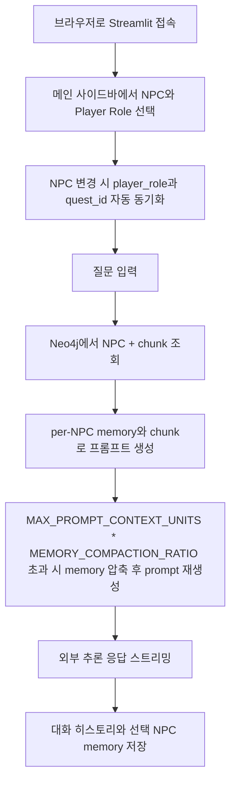

메인 사이드바의 조작 범위는 NPC select, Player Role select, 대화 초기화, debug popovers, per-NPC summaries다. Quest 진행 상태와 hint level은 같은 session state를 쓰지만, 직접 조작은 admin page의 Quest Admin 탭에서 한다.

### 11.3 Admin page 운영

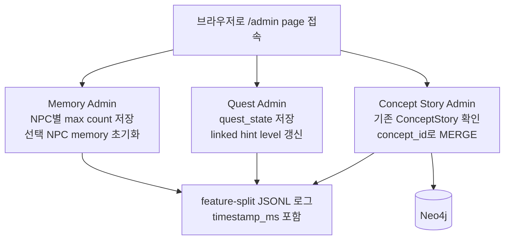

Memory Admin은 Streamlit 세션 상태만 바꾼다. Quest Admin은 `quest_state_by_quest`와 `allowed_hint_level_by_quest`를 갱신하고, 현재 메인 앱의 `quest_id`와 같은 quest를 저장하면 `quest_state`와 `allowed_hint_level`도 함께 맞춘다. Concept Story Admin은 `ConceptStory` 노드를 확인하고 `MERGE`하지만, chat memory나 `get_allowed_chunks()`의 `KnowledgeChunk` 조회에는 참여하지 않는다.

### 11.4 원천 데이터 수정 후 반영

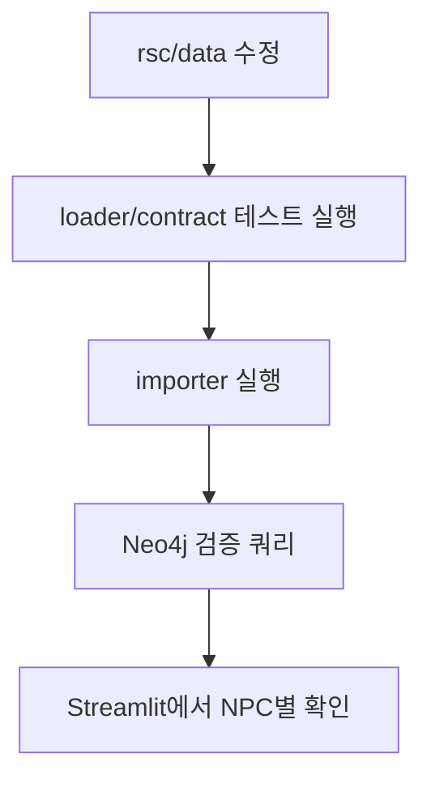

원천 데이터 수정이 `chunk_id`, `quest_id`, `clue_id` 같은 고유 ID를 바꾸는 경우에는 기존 노드와 관계가 남을 수 있다. 이때는 개발 환경에서 `--reset`으로 재생성하고, 운영 환경에서는 삭제/마이그레이션 계획을 별도로 세우는 편이 안전하다.

## 12. 에러 흐름

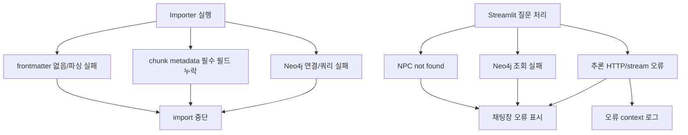

Importer는 데이터 품질 문제가 있으면 즉시 예외를 발생시켜 중단한다. 반면 Streamlit 앱은 사용자 화면을 유지해야 하므로 오류를 화면에 표시한다. vLLM 요청 실패는 오류 context만 로그로 남기고 assistant chat, 선택 NPC memory, 정상 interaction log에는 저장하지 않는다.

## 13. 검증 지점

### 13.1 파일/파서 단계

| 검증 | 목적 |
| --- | --- |
| NPC 수 4 | 모든 NPC Markdown frontmatter가 읽히는지 확인 |
| KnowledgeChunk 수 26 | 모든 `story-chunk`/`chunk` fenced block이 파싱되는지 확인 |
| clue ID 참조 검증 | placeholder clue 생성 방지 |
| quest/world YAML key 검증 | 관계 생성에 필요한 필드가 importer 계약과 맞는지 확인 |

### 13.2 DB 단계

| 검증 쿼리 | 확인 내용 |
| --- | --- |
| NPC별 `KNOWS` count | NPC별 chunk 분포가 기대값과 맞는지 확인 |
| `Clue.name IS NULL` | chunk 참조만 있고 정의가 없는 clue 탐지 |
| Quest 관계 조회 | `INVOLVES`, `REQUIRES_CLUE`, `HAS_ANSWER` 생성 확인 |

### 13.3 앱 단계

| 검증 | 확인 내용 |
| --- | --- |
| Streamlit health | 앱 프로세스가 떠 있는지 확인 |
| 메인 사이드바 NPC/Role | NPC select와 Player Role select가 보이고, NPC 변경 시 role과 quest가 자동 동기화되는지 확인 |
| 메인 사이드바 reset | 대화 초기화가 `messages`, per-NPC memory, `last_debug`를 비우는지 확인 |
| Debug popovers | `Debug: Retrieved Chunks`, `Debug: Prompt`, `Debug: Runtime`이 마지막 조회 chunk, 최종 프롬프트, 런타임 설정을 나누어 보여주는지 확인 |
| per-NPC summaries | 사이드바의 NPC별 expander가 최근 대화 수, 압축 요약, 현재 대화 요약을 보여주는지 확인 |
| Admin page tabs | Memory Admin, Quest Admin, Concept Story Admin 탭이 열리고 각 feature log가 `timestamp_ms`와 함께 남는지 확인 |
| Quest Admin | quest state 저장 시 linked hint level이 상태 규칙대로 바뀌고 현재 quest와 같으면 메인 상태도 맞춰지는지 확인 |
| Concept Story Admin | `concept_id` 조회와 `ConceptStory` MERGE가 standalone 노드로 동작하는지 확인 |

## 14. 현재 MVP의 의도적 단순화

현재 MVP는 GraphRAG의 전체 최종형이 아니라, 그래프 기반 지식 제한을 먼저 검증하는 단계다.

의도적으로 단순화된 부분은 다음과 같다.

| 영역 | 현재 방식 | 이후 확장 가능성 |
| --- | --- | --- |
| ID | 짧은 ID 직접 사용 | canonical ID alias 계층 추가 |
| 검색 | Neo4j 관계/속성 필터 | embedding 검색과 graph traversal 결합 |
| UI 옵션 | 코드에 하드코딩된 NPC/Role/Quest 목록 | DB에서 동적 로딩 |
| 대화 상태 | Streamlit session state와 admin page 제어 | 게임 서버/세이브 상태 연동 |
| 대화 기억 | 세션 안의 per-NPC memory와 summary | 영구 저장소 또는 계정별 memory |
| ConceptStory | admin page가 standalone node로 확인/MERGE | 검색 경로에 넣을 경우 별도 설계 필요 |
| 데이터 적재 | 수동 importer 실행 | 배포 파이프라인/관리자 도구 연동 |
| 오류 처리 | 화면 표시 중심 | 사용자 친화적 오류 분류/재시도 정책 |

이 단순화 덕분에 현재 구조에서는 “NPC가 아는 것만 말하게 하기”, “퀘스트 상태와 힌트 레벨에 따라 공개 범위를 제한하기”, “세션 안에서 NPC별 대화 맥락을 유지하기”, “원천 데이터 변경과 admin 입력이 DB와 앱에 어떻게 반영되는지 추적하기”를 빠르게 검증할 수 있다.

## 15. 최종 데이터 흐름 요약

```mermaid
flowchart LR
    D1[작성자\nMarkdown/YAML 작성]
    D2[Importer\n파일 파싱]
    D3[Neo4j\n노드/관계 저장]
    A1[Admin page\nMemory/Quest/ConceptStory 운영]
    D4[Streamlit 메인 앱\n현재 NPC/Role/Quest 상태 수집]
    D5[Cypher 조회\nNPC + 허용 chunk]
    D6[Prompt 생성\n캐릭터/상태/근거/memory 조합]
    D7[외부 추론 서비스\n응답 생성]
    D8[Streamlit\n스트리밍 출력 + 히스토리/memory 저장]

    D1 --> D2 --> D3 --> D4 --> D5 --> D6 --> D7 --> D8
    A1 --> D4
    A1 --> D3
```

한 문장으로 정리하면, 현재 MVP는 `rsc/data`의 세계관 원천 데이터를 Neo4j 그래프로 바꾼 뒤, Streamlit 메인 앱이 현재 NPC, 역할, 퀘스트 상태, 세션 memory를 기준으로 “선택된 NPC가 말할 수 있는 KnowledgeChunk”만 가져와 답변 근거로 쓰고, 별도 admin page가 memory 설정, Quest 상태, standalone ConceptStory 노드를 운영하는 구조다.
